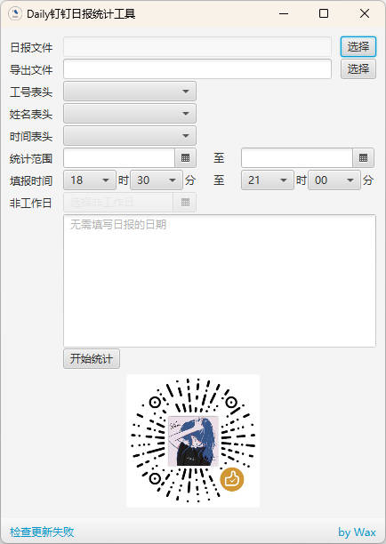

# Daily

#### 介绍
Javafx编写的钉钉日报统计工具

如有任何问题请发邮件至`github#wax.today`（#换成@）,邮件标题以`【Daily工具反馈】`开头

[最新发行版本](https://gitee.com/WaxToday/Daily/releases/latest)

[Github地址](https://github.com/WaxToday/Daily)

#### 运行截图

#### 使用说明

###### 环境

1. 有java环境的电脑直接使用jar文件，根据自己的java版本选择`Daily.jar`（>=JDK11）或`Daily_JDK8.jar`（JDK1.8）
2. Windows直接根据处理器选择exe文件下载
- Daily_32-bit_x86.exe 32位
- Daily_64-bit_x86.exe 64位
- Daily_ARM64.exe ARM处理器选这个（Mac M1芯片的虚拟机用这个，至于没有虚拟机也不会配Java环境的还是别玩Mac了。。

推荐使用Daily.jar

###### 操作

操作很简单，傻瓜式
1. 选择从钉钉导出的报表文件
- 会自动生成导出文件名（可以手动调整）
- 会自动匹配工号、昵称、填报时间的表头
- 会从表格中检索最早的填报日期和最晚的填报日期，设为统计的日期范围
- 统计范围改变会自动计算范围内所有的周六周日，添加到非工作日内
2. 根据自己实际情况调整这些参数
3. 点击【开始统计】按钮，开始导出（进度条会加载两次，第一次是统计，第二次是写入到导出文件）
4. 导出完毕后关闭提示框，自动打开导出的文件所在目录

欢迎多提意见或建议  :clap: 

欢迎右上角点Star  :star: 

欢迎不差钱的老板们打赏孩子  :moneybag: 

